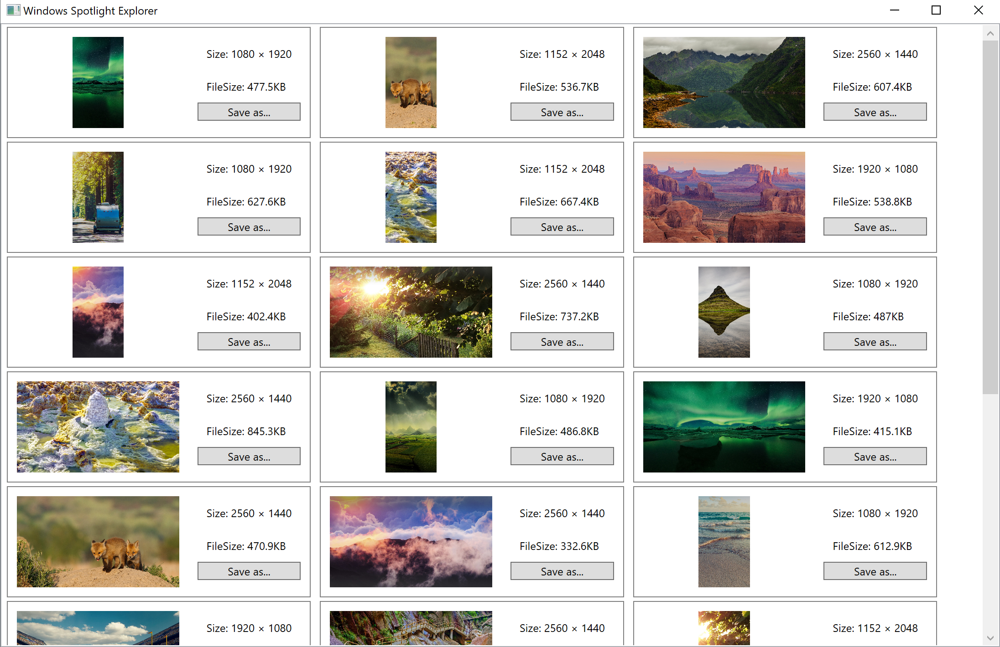

# Windows Spotlight Explorer

Windows Spotlight Explorer is an utility helps you save images provided by Windows spotlight of your Windows 10 lock screen.
Currently, only images larger than 100 KB will be shown.

